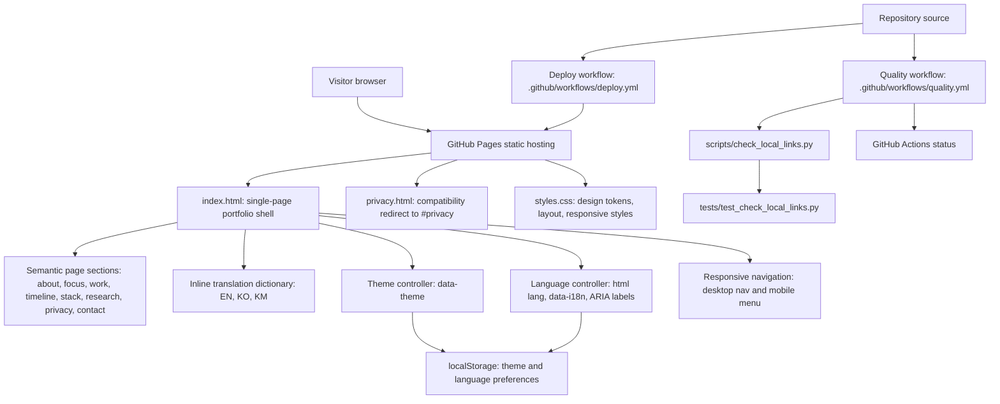
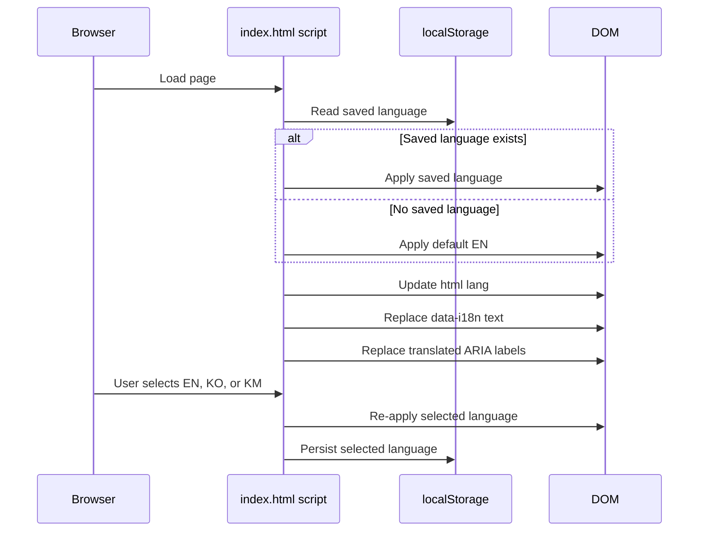

# Architecture Note

## Overview
This repository is a static, single-page portfolio designed for low operational overhead and predictable behavior on GitHub Pages. It uses semantic HTML, scoped CSS, and vanilla JavaScript with no framework runtime.

## System architecture diagram

The system is intentionally static: GitHub Pages serves the public files, `index.html` owns the content and behavior, `styles.css` owns presentation, and GitHub Actions verifies and deploys the repository.

## File responsibilities
- `index.html`
  - Main document and single-page content surface
  - Section anchors for navigation (`#about`, `#focus`, `#work`, `#timeline`, `#stack`, `#research`, `#privacy`, `#contact`)
  - Inline translation dictionary (`en`, `ko`, `km`)
  - Theme/language/mobile-nav behavior scripts
- `styles.css`
  - Design tokens (`:root` variables), theme values, typography stacks
  - Layout and component styling
  - Responsive breakpoints for navigation/cards/timeline
  - Language-specific typography hardening (including Khmer fallback behavior)
- `privacy.html`
  - Compatibility redirect to `index.html#privacy`
  - Maintains a stable direct URL while keeping privacy content in the single-page flow
- `.github/workflows/deploy.yml`
  - Builds and deploys to GitHub Pages
- `.github/workflows/quality.yml`
  - Lightweight quality checks for static HTML sanity and offline link integrity
  - Executes repository-local link checks via `scripts/check_local_links.py`
- `scripts/check_local_links.py`
  - Validates repository-local markdown/HTML links in key site/docs files
  - Detects missing targets, missing fragment anchors, and path escapes outside repo root
- `tests/test_check_local_links.py`
  - Unit-test coverage for slug generation, fragment detection, path resolution, and error reporting

## Single-page section architecture
The page is organized into anchored semantic sections:
1. Hero/About
2. Focus tags
3. Selected work cards
4. Timeline (employment, education, awards)
5. Tech stack
6. Research note
7. Privacy
8. Contact/footer controls

This keeps navigation straightforward and supports direct anchor links without client-side routing.

## Theme toggle design
- Theme is represented by `data-theme` on `<html>` (`light` or `dark`)
- Startup logic reads `prefers-color-scheme`, then localStorage override if available
- Toggle updates DOM state and persists to localStorage
- Theme state is resolved early to reduce flash/inconsistent first paint

## Language toggle design
- Supported language set: `en`, `ko`, `km`
- `applyLanguage` updates:
  - `<html lang="...">`
  - Text nodes bound by `data-i18n`
  - ARIA labels bound by `data-i18n-attr-aria-label`
  - Language control short label
- Language preference is persisted in localStorage and restored on load

## Translation storage and application
- Translations live in one inline `translations` object in `index.html`
- Keys must remain structurally consistent across languages
- Missing keys degrade to existing DOM text rather than breaking script execution

## Responsive navigation behavior
- Desktop: always-visible nav list
- Mobile (`<= 768px`): collapsed toggle with open/close state and `aria-expanded`
- Safety behavior:
  - Auto-close on link selection
  - Auto-close on outside click
  - Auto-close on `Escape`

## Privacy strategy
- Primary privacy content is part of the main page (`#privacy`) to keep policy context close to site behavior
- `privacy.html` exists as a redirect compatibility path and is marked `noindex`

## Why vanilla HTML/CSS/JS
- Small dependency surface and low maintenance burden
- Fast startup for static hosting
- High portability across constrained or locked-down browser environments
- No toolchain required for local preview and small iterative edits

## Robustness notes
- **Low dependency surface:** no framework runtime, no analytics scripts, no package toolchain requirement
- **Constrained-browser resilience:** static content first; behavior enhancements layered on top
- **Graceful degradation:** core content/navigation remain available even if some scripts fail
- **Typography resilience:** system-first/fallback-first strategy, including Khmer readability safeguards

## Quality-check architecture
- Scope remains intentionally lightweight for a static portfolio repository:
  1. Basic HTML sanity checks in workflow shell steps
  2. Local link validation through `scripts/check_local_links.py`
- Link-check inputs are constrained to core public files:
  - `README.md`, `ARCHITECTURE.md`, `CHANGELOG.md`, `index.html`, `privacy.html`
- Test strategy:
  - `tests/test_check_local_links.py` validates the checker’s parsing and failure modes
  - Local run command: `python -m unittest discover -s tests -v`

## Maintenance guidance for new translated UI text
When adding or changing user-facing text:
1. Add/update the `data-i18n` key in markup.
2. Add/update the same key in all three translation dictionaries (`en`, `ko`, `km`).
3. If text affects accessibility labels, wire with `data-i18n-attr-aria-label`.
4. Check long-string behavior in mobile widths (especially `km`) to avoid overflow.
5. Keep wording semantically aligned across languages; avoid mixing private/internal terminology into public copy.
