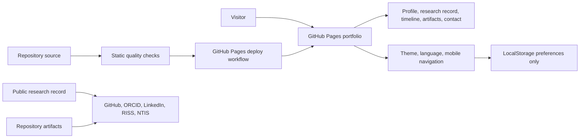
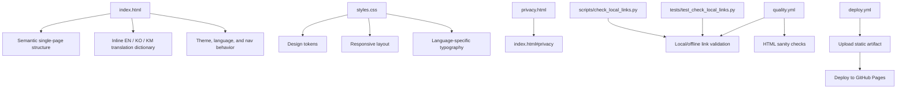

# dimangite.github.io

[](https://github.com/dimangite/dimangite.github.io/actions/workflows/deploy.yml)
[](https://github.com/dimangite/dimangite.github.io/actions/workflows/quality.yml)

Static GitHub Pages portfolio for Dimang Chhol: a public-facing research and engineering profile focused on predictive modeling, reproducible ML evaluation, and lightweight static-site delivery.

**Live site:** https://dimangite.github.io  
**Architecture notes:** [`ARCHITECTURE.md`](ARCHITECTURE.md)  
**Privacy entry point:** [`privacy.html`](privacy.html)

## Portfolio System Overview

This repository demonstrates a low-dependency portfolio system: semantic HTML, responsive CSS, trilingual UI text, local preference persistence, GitHub Pages deployment, and lightweight CI checks.



## System design



## Engineering signal mapping

| Signal | Evidence in this repo |
| --- | --- |
| Static-site delivery | GitHub Pages deployment workflow with explicit deploy job |
| Front-end engineering | Semantic sections, responsive layout, keyboard-accessible controls |
| i18n discipline | Synchronized English, Korean, and Khmer translation dictionary |
| Low-dependency design | Vanilla HTML, CSS, and JavaScript; no framework runtime |
| Privacy-aware behavior | No analytics/tracking scripts; only local theme/language preferences |
| Quality awareness | Static quality workflow, HTML sanity checks, and local-link validation |
| Portfolio governance | Public evidence links separated from private manuscript/research artifacts |

## Scope and boundaries

**In scope**

- Single-page portfolio UI and content
- Theme/language preference behavior
- Accessibility and responsive hardening
- Static-site deployment and lightweight quality checks
- Public-facing profile, research-record, and artifact links

**Out of scope**

- Private research/manuscript repositories
- Unpublished datasets or submission artifacts
- Analytics or tracking scripts
- Framework migrations and heavy build tooling

## Stack

| Layer | Implementation |
| --- | --- |
| Markup | HTML5 |
| Styling | CSS3 |
| Behavior | Vanilla JavaScript |
| Hosting | GitHub Pages |
| CI/CD | GitHub Actions |
| Quality checks | Shell checks, Python local-link checker, unittest |

## Repository structure

```text
.
├─ .github/
│  └─ workflows/
│     ├─ deploy.yml
│     └─ quality.yml
├─ scripts/
│  └─ check_local_links.py
├─ tests/
│  └─ test_check_local_links.py
├─ index.html
├─ styles.css
├─ privacy.html
├─ robots.txt
├─ sitemap.xml
├─ favicon.svg
├─ ARCHITECTURE.md
├─ CHANGELOG.md
└─ README.md
```

## File responsibilities

| File | Responsibility |
| --- | --- |
| `index.html` | Single-page structure, translation dictionary, UI behavior scripts |
| `styles.css` | Design tokens, layout, responsive rules, language-specific typography |
| `privacy.html` | Redirect entry point to `index.html#privacy` |
| `.github/workflows/deploy.yml` | GitHub Pages deployment |
| `.github/workflows/quality.yml` | Static quality checks and local-link validation |
| `scripts/check_local_links.py` | Repository-local link checker for docs/pages |
| `tests/test_check_local_links.py` | Unit tests for link-checking behavior |

## i18n model

Supported UI languages:

- English: `en`
- Korean: `ko`
- Khmer: `km`

Translation strings are maintained in one inline dictionary in `index.html`. UI text and key ARIA labels are updated through `data-i18n*` hooks. When adding user-facing text, add keys for all three languages in the same change.

## Privacy model

The site does not intentionally use third-party trackers or advertising cookies. Theme and language preferences may be stored locally in the visitor's browser. Active manuscript code, unpublished experiments, datasets, and submission artifacts are intentionally kept outside this public portfolio repository.

## Local preview

From the repository root:

```bash
python -m http.server 8000
```

Open:

```text
http://localhost:8000
```

## Verification

Run the same checks used by the repository workflow:

```bash
python scripts/check_local_links.py
python -m unittest discover -s tests -v
```

## Maintenance rules

- Keep edits small, explicit, and production-safe for a static site.
- Keep `canonical`, Open Graph, robots, and sitemap metadata truthful and minimal.
- Avoid new dependencies unless they provide clear maintenance value.
- Keep translation and metadata updates synchronized with any new sections.
- Do not add analytics or tracking scripts.

## Minimal future improvements

- Add a real social preview image (`og:image`) when an approved asset is available.
- Add CodeQL only if JavaScript analysis is intentionally introduced as a maintained workflow.
